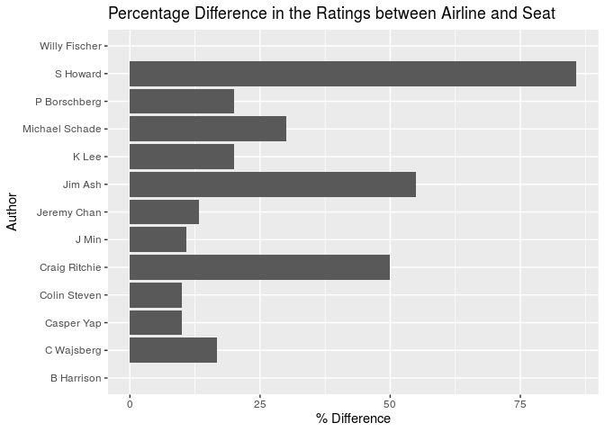

Project proposal
================
macRoni

``` r
library(tidyverse)
library(broom)
library(readr)
library(skimr)
library(tidytext)
```

## 1\. Introduction

The dataset is a Skytrax User Reviews Dataset (published August 2nd,
2015) at <https://github.com/quankiquanki/skytrax-reviews-dataset> .

General Theme: How do the amenities impact the flight’s overall rating?

## 2\. Data

``` r
airline <- read_csv("/cloud/project/data/airline.csv")
lounge <- read_csv("/cloud/project/data/lounge.csv")
seat <- read_csv("/cloud/project/data/seat.csv")
```

``` r
glimpse(airline)
```

    ## Rows: 41,396
    ## Columns: 20
    ## $ airline_name                  <chr> "adria-airways", "adria-airways", "adri…
    ## $ link                          <chr> "/airline-reviews/adria-airways", "/air…
    ## $ title                         <chr> "Adria Airways customer review", "Adria…
    ## $ author                        <chr> "D Ito", "Ron Kuhlmann", "E Albin", "Te…
    ## $ author_country                <chr> "Germany", "United States", "Switzerlan…
    ## $ date                          <date> 2015-04-10, 2015-01-05, 2014-09-14, 20…
    ## $ content                       <chr> "Outbound flight FRA/PRN A319. 2 hours …
    ## $ aircraft                      <chr> NA, NA, NA, NA, NA, NA, NA, NA, NA, NA,…
    ## $ type_traveller                <chr> NA, NA, NA, NA, NA, NA, NA, NA, NA, NA,…
    ## $ cabin_flown                   <chr> "Economy", "Business Class", "Economy",…
    ## $ route                         <chr> NA, NA, NA, NA, NA, NA, NA, NA, NA, NA,…
    ## $ overall_rating                <dbl> 7, 10, 9, 8, 4, 9, 5, 9, 8, 10, 9, 7, 8…
    ## $ seat_comfort_rating           <dbl> 4, 4, 5, 4, 4, 4, 4, 5, 4, 5, 4, 4, 4, …
    ## $ cabin_staff_rating            <dbl> 4, 5, 5, 4, 2, 4, 4, 5, 3, 5, 4, 5, 4, …
    ## $ food_beverages_rating         <dbl> 4, 4, 4, 3, 1, 3, 1, 4, 4, 4, 4, 3, 4, …
    ## $ inflight_entertainment_rating <dbl> 0, 1, 0, 1, 2, 3, 0, 3, 1, 4, 4, 3, 0, …
    ## $ ground_service_rating         <dbl> NA, NA, NA, NA, NA, NA, NA, NA, NA, NA,…
    ## $ wifi_connectivity_rating      <dbl> NA, NA, NA, NA, NA, NA, NA, NA, NA, NA,…
    ## $ value_money_rating            <dbl> 4, 5, 5, 4, 2, 4, 3, 4, 4, 4, 4, 5, 4, …
    ## $ recommended                   <dbl> 1, 1, 1, 1, 0, 1, 1, 1, 1, 1, 1, 1, 1, …

``` r
glimpse(lounge)
```

    ## Rows: 2,264
    ## Columns: 21
    ## $ airline_name             <chr> "adria-airways", "aegean-airlines", "aegean-…
    ## $ link                     <chr> "/lounge-reviews/adria-airways", "/lounge-re…
    ## $ title                    <chr> "Adria Airways Business Class Lounge", "Busi…
    ## $ author                   <chr> "R Deu", "Andreas Kar", "A Diakomichalis", "…
    ## $ author_country           <chr> "Spain", "Germany", "Greece", "Spain", "Unit…
    ## $ date                     <date> 2014-03-09, 2015-06-13, 2014-10-05, 2014-03…
    ## $ content                  <chr> "There are 2 separate areas with arm chairs …
    ## $ lounge_name              <chr> "ADRIA AIRWAYS BUSINESS CLASS LOUNGE REVIEW"…
    ## $ airport                  <chr> NA, "Larnaca Airport", "Athens Airport", "At…
    ## $ lounge_type              <chr> "Business Class", "Business Class", "Busines…
    ## $ date_visit               <chr> NA, "13-03-2015", NA, NA, NA, NA, NA, NA, NA…
    ## $ type_traveller           <chr> NA, "Solo Leisure", NA, NA, NA, NA, NA, NA, …
    ## $ overall_rating           <dbl> 3, 5, 5, 2, 5, 4, 4, 3, 3, 4, 3, 2, 1, 3, 4,…
    ## $ comfort_rating           <dbl> 3, 4, 5, 3, 5, 4, 4, 4, 4, 4, 3, 4, 1, 4, 4,…
    ## $ cleanliness_rating       <dbl> 4, 4, 5, 3, 5, 5, 5, 4, 4, 5, 4, 3, 3, 3, 4,…
    ## $ bar_beverages_rating     <dbl> 3, 3, 5, 2, 4, 3, 3, 2, 3, 4, 3, 1, 1, 4, 4,…
    ## $ catering_rating          <dbl> 3, 3, 4, 1, 4, 2, 3, 2, 1, 2, 1, 1, 1, 4, 4,…
    ## $ washrooms_rating         <dbl> 3, 3, 4, 2, 4, 4, 4, 3, 3, 4, 3, 0, 1, 2, 4,…
    ## $ wifi_connectivity_rating <dbl> 2, 4, 5, 3, 5, 5, 5, 4, 3, 4, 4, 4, 1, 4, 5,…
    ## $ staff_service_rating     <dbl> 2, 4, 5, 2, 5, 3, 4, 1, 1, 3, 3, 2, 1, 2, 4,…
    ## $ recommended              <dbl> 1, 1, 1, 0, 1, 0, 0, 0, 0, 1, 0, 0, 0, 0, 1,…

``` r
glimpse(seat)
```

    ## Rows: 1,258
    ## Columns: 21
    ## $ airline_name        <chr> "aegean-airlines", "aegean-airlines", "aer-lingus…
    ## $ link                <chr> "/seat-reviews/aegean-airlines", "/seat-reviews/a…
    ## $ title               <chr> "Aegean Airlines customer review", "Aegean Airlin…
    ## $ author              <chr> "Jay Simpson", "Paul Staples", "L Pulliam", "D Br…
    ## $ author_country      <chr> "United Kingdom", "United Kingdom", "United State…
    ## $ date                <date> 2015-07-20, 2013-01-21, 2015-07-07, 2010-10-22, …
    ## $ content             <chr> "LHR to Larnaca return. Plane was clean and in go…
    ## $ aircraft            <chr> "A320-200", "AIRBUS A320", "A330", "Airbus A330",…
    ## $ seat_layout         <chr> "3x3", "3x3", "2x4x2", "2x4x2", "3x3", "2-4-2", "…
    ## $ date_flown          <chr> "19-07-2015", NA, "06-07-2015", NA, "01-07-2015",…
    ## $ cabin_flown         <chr> "Economy", "Economy", "Economy", "Economy", "Econ…
    ## $ type_traveller      <chr> "Solo Leisure", NA, "Couple Leisure", NA, "Busine…
    ## $ overall_rating      <dbl> 10, 9, 6, 5, 1, 9, 6, 4, 7, 6, 9, 10, 1, 7, 1, 2,…
    ## $ seat_legroom_rating <dbl> 4, 4, 3, 2, 1, 5, 4, 2, 3, 3, 5, 5, 1, 3, 1, 1, 4…
    ## $ seat_recline_rating <dbl> 4, 4, 3, 3, 1, 3, 4, 1, 3, 3, 5, 4, 3, 3, 1, 2, 4…
    ## $ seat_width_rating   <dbl> 4, 4, 3, 3, 1, 5, 4, 3, 3, 3, 4, 4, 3, 3, 3, 2, 3…
    ## $ aisle_space_rating  <dbl> 5, 4, 3, 3, 2, 5, 3, 2, 4, 3, 3, 5, 1, 3, 1, 1, 4…
    ## $ viewing_tv_rating   <dbl> 4, 4, 3, 4, 1, 5, 3, 0, 4, 0, 0, 5, 2, 3, 2, 2, 4…
    ## $ power_supply_rating <dbl> NA, NA, 3, NA, 5, 5, NA, NA, NA, NA, NA, NA, NA, …
    ## $ seat_storage_rating <dbl> 4, NA, 3, NA, 1, 5, NA, NA, NA, NA, NA, NA, NA, N…
    ## $ recommended         <dbl> 1, 1, 1, 0, 1, 1, 1, 0, 1, 0, 1, 1, 0, 1, 0, 0, 1…

## 3\. Data analysis plan

We first began by exploring the overall average ratings of the different
airlines.

``` r
airline %>%
  group_by(airline_name) %>%
  summarise( average_overall_rating = mean(overall_rating, na.rm = TRUE)) %>%
  arrange(desc(average_overall_rating))
```

    ## `summarise()` ungrouping output (override with `.groups` argument)

    ## # A tibble: 362 x 2
    ##    airline_name             average_overall_rating
    ##    <chr>                                     <dbl>
    ##  1 beijing-capital-airlines                  10   
    ##  2 danish-air                                10   
    ##  3 eastarjet                                 10   
    ##  4 la-compagnie                              10   
    ##  5 loganair                                  10   
    ##  6 air-busan                                  9.45
    ##  7 atlantic-airways                           9.25
    ##  8 avianca-brasil                             9   
    ##  9 europe-airpost                             9   
    ## 10 jeju-air                                   9   
    ## # … with 352 more rows

1.  How does the overall ratings for airlines change depending of the
    time of year? Do these patterns repeat every year? Which traveler
    type is prevalent during which time of the year?

First, all NAs for the response variable and the predictor were removed.

``` r
airline_nonas <- airline %>%
  drop_na(overall_rating) #removing any NAs
```

Next, we want to investigate how time affects ratings. As the research
question focuses on how airlines get high ratings, the five airlines
with the highest rating were found. A limit of at least 100 survey
submissions was imposed to increase the number of data points.

    ## # A tibble: 106 x 3
    ##    airline_name       mean_overall_rating     n
    ##    <chr>                            <dbl> <int>
    ##  1 asiana-airlines                   8.35   301
    ##  2 garuda-indonesia                  8.31   351
    ##  3 air-astana                        8.28   103
    ##  4 bangkok-airways                   8.12   213
    ##  5 indigo-airlines                   8.08   104
    ##  6 korean-air                        8.03   315
    ##  7 eva-air                           7.98   296
    ##  8 aegean-airlines                   7.82   227
    ##  9 singapore-airlines                7.77   432
    ## 10 airasia-x                         7.71   246
    ## # … with 96 more rows

<!-- -->

These airlines were plotted against time to identify any correlations.

<!-- -->

As the visualization shows, all of the airlines receive ratings in
between 5-10, with air-astana showing an increase at the end of 2015.
For indigo-airlines, garuda-indonesia and bangkok-airlines, the ratings
deteriorated at the end of 2015. Garuda-indonesia ratings stay constant
throughout both years.

There is no clear pattern in each year, which makes sense as the airline
companies will normally try to provide the same service throughout the
year. And, this may also mean that the airlines probably don’t take the
comments given by the passengers too seriously.

1.5. Which amenity significantly contributes to the top 5 airlines’
overall rating?

One can look at the individual ratings (Seat Comfort, Cabin Staff, Food
Beverages, Inflight Entertainment and Money Value) and see if there is
one rating that sticks out depending on the airline.

    ## Warning: Removed 2 rows containing non-finite values (stat_smooth).

    ## Warning: Removed 9 rows containing non-finite values (stat_smooth).

<!-- -->
As the visualisation shows, to increase in overall rating, all
individaul ratings have to increase. This can be seen in the example of
Air Astana. For airlines that decreased in overall rating
(bangkok-airways and indigo-airlines), only specific individual ratings
decreased or had an overall worse score (especially inflight
entertainment).

# Question 2

2.  To what extent do passengers in first class give better ratings than
    passengers in other classes? Also, how satisfied are the first class
    passengers with the services they mentioned in their comments the
    most about?

Let’s look at the average overall rating the passengers gave for each of
the classes. Hypothesis: We expect first class to have a higher rating
since, as per the norm, first class is considered to be the most
preferable one.

``` r
airline %>%
  filter(!is.na(overall_rating), !is.na(cabin_flown) ) %>%
  group_by(cabin_flown) %>%
  summarise(mean_overall_rating = mean(overall_rating, na.rm = TRUE)) %>%
  arrange(desc(mean_overall_rating))
```

    ## `summarise()` ungrouping output (override with `.groups` argument)

    ## # A tibble: 4 x 2
    ##   cabin_flown     mean_overall_rating
    ##   <chr>                         <dbl>
    ## 1 Business Class                 6.87
    ## 2 First Class                    6.65
    ## 3 Economy                        5.97
    ## 4 Premium Economy                5.86

Business class has received the highest amount of rating. It is closely
followed by First class. This doesn’t match our hypothesis.

Is this because passengers feel the business class services are better
or fewer people choose to travel in first class? Let’s find out\!

``` r
airline %>%
  filter(!is.na(overall_rating), !is.na(cabin_flown) ) %>%
  group_by(cabin_flown) %>%
  count(cabin_flown) %>%
  arrange(desc(n))
```

    ## # A tibble: 4 x 2
    ## # Groups:   cabin_flown [4]
    ##   cabin_flown         n
    ##   <chr>           <int>
    ## 1 Economy         26429
    ## 2 Business Class   6133
    ## 3 Premium Economy  1445
    ## 4 First Class       846

Now, it is obvious that first class has a lower rating compared to
business class since fewer passengers chose that cabin type.

Let’s look into what type of travelers opt for first class cabin which
may be able to explain the above.

``` r
airline %>%
  filter (!is.na(cabin_flown), !is.na(type_traveller), !is.na(overall_rating) ) %>%
  ggplot(aes(x = cabin_flown, fill = type_traveller)) +
  geom_bar(position ="fill") +
  coord_flip()
```

<!-- -->

This reveals the type of travelers in each of the cabins.

For first class, as expected, the solo leisure traveller\_type prevails.
This adds up since the tickets may cost significantly more than any of
the other classes so it may not be pocket-friendly to travel in larger
groups than 1.  
The distribution of travelers also reveals why first class has the
smallest number of passengers since ‘couple leisure’ and ‘family
leisure’ categories don’t form a large section of first class cabin
passengers.

Let’s look into which amenities did the first class cabin passengers
mention the most about in their comments and how did they rate them?

Filtered for NAs for variables that I am entirely sure of looking into.

``` r
airline_amen_nonas <- airline %>%
  drop_na(overall_rating, value_money_rating, cabin_flown)  
```

Text analysis:

``` r
two_words <- airline_amen_nonas %>%
  filter( cabin_flown == "First Class" ) %>%
  unnest_tokens(word, content, token = "ngrams", n = 2) %>%
  count(word, sort = TRUE) %>% 
  slice_max(n, n = 65)

#single_word <- airline_amen_nonas %>%
 # filter( cabin_flown == "First Class" ) %>%
 # unnest_tokens(word, content) %>%
 # anti_join(get_stopwords(), by = "word") %>%
 # count(word, sort = TRUE) %>% 
 # slice_max(n, n = 20)
```

The results reveal phrases like “wifi connectivity”, “flight
entertainment” don’t appear commonly, so I will choose to not look into
the amenity variable associated with those words as it is not
***highly*** reviewed by the first class passengers. To be thorough, I
have unnested the sentences into two tokens instead of just words.

So, after narrowing my search using text analysis, I will filter for
seat, cabin staff and food and, explore the ratings given for these. The
amen\_filtered has been extended accordingly from airline\_amen\_nonas.

``` r
amen_filtered <- airline %>%
  drop_na(overall_rating, cabin_flown, seat_comfort_rating,
          cabin_staff_rating, food_beverages_rating)  
```

``` r
amen_filtered %>%
  filter( cabin_flown == "First Class" ) %>%
  select(overall_rating, value_money_rating, seat_comfort_rating,
          cabin_staff_rating, food_beverages_rating) %>%
  summarise(mean_seat_comfort_rating = mean(seat_comfort_rating),
            mean_cabin_staff_rating = mean(cabin_staff_rating),
            mean_food_beverages_rating = mean(food_beverages_rating),
            mean_overall_rating = mean(overall_rating))
```

    ## # A tibble: 1 x 4
    ##   mean_seat_comfort_r… mean_cabin_staff_r… mean_food_beverage… mean_overall_rat…
    ##                  <dbl>               <dbl>               <dbl>             <dbl>
    ## 1                 3.80                3.84                3.40              6.63

Perhaps, this can mean that the mention of these services in the
comments made has been fairly positive according to the mean results
yielded. After looking at variability, we can add that passengers had
strong opinions about the food and beverages in the first class cabin of
the flight. The mean values show that on average, the passengers were
happier with the service offered by the crew instead of the seating
comfort level. This is supported by the density plot as there are fewer
observations \< 3 for cabin staff rating than seat\_comfort rating.

But, let’s see the variability to reaffirm our claim.

``` r
 y <- amen_filtered %>%
  group_by(airline_name) %>%
  filter( cabin_flown == "First Class" ) %>%
  select(overall_rating, value_money_rating, seat_comfort_rating,
          cabin_staff_rating, food_beverages_rating) %>%
  summarise(mean_seat_comfort_rating = mean(seat_comfort_rating),
            mean_cabin_staff_rating = mean(cabin_staff_rating),
            mean_food_beverages_rating = mean(food_beverages_rating),
            mean_value_money_rating = mean(value_money_rating),
            mean_overall_rating = mean(overall_rating))
```

    ## Adding missing grouping variables: `airline_name`

    ## `summarise()` ungrouping output (override with `.groups` argument)

``` r
seat_var <- y %>%
ggplot( mapping = aes(x = mean_seat_comfort_rating)) +
  geom_density() 

cabin_var <- y %>%
ggplot( mapping = aes(x = mean_cabin_staff_rating)) +
  geom_density() 

food_var <- y %>%
ggplot( mapping = aes(x = mean_food_beverages_rating)) +
  geom_density()

overall_var <-y %>%
  ggplot( mapping = aes(x = mean_overall_rating)) +
  geom_density()
```

This runs in line with the average statistics visualized in the tibble
before.

# End of question 2

Majority of the travelers have rated the airlines a 10 (5861 to be
exact) but ratings like 8, 9, 10 are also common. Surprisingly, the
extreme value of rating = 1 is also frequent.

Do airlines improve their ratings with a particular reviewer over time,
if so in which category are the improvements made Y: overall\_rating,
other variables TBD after the most significant contributor is found X:
author, date, airline\_name

Do positive reviews on an airline and positive reviews on lounge and
seat have a correlation? Y: a graph showing correlation X:
overall\_rating (in seat and lounge data set )

Hypothesis: we expect seat rating to have a stronger correlation than
the lounge rating because not everyone uses the lounge.

To answer this question, only the authors that have rated the airline,
lounge and seat will be selected to see if rating either the lounge or
seat positively will result in the airline being rated positively.

To start only the relevant columns are chosen, then the data sets are
joined into one and any NAs are removed so that only the authors wanted
remain.

``` r
airline_rating <- airline %>%
select(airline_name, overall_rating, author, date) %>%
  rename(airline_rating = "overall_rating",
         date_airline = "date")

lounge_rating <- lounge %>%
select(airline_name, overall_rating, author, date) %>%
  rename(lounge_rating = "overall_rating",
         date_lounge = "date")

seat_rating <- seat %>%
select(airline_name, overall_rating, author, date) %>%
  rename(seat_rating = "overall_rating",
         date_seat = "date")
```

``` r
airline_lounge <- full_join(lounge_rating, airline_rating) %>%
  na.omit()
```

    ## Joining, by = c("airline_name", "author")

``` r
airline_lounge
```

    ## # A tibble: 1,058 x 6
    ##    airline_name lounge_rating author     date_lounge airline_rating date_airline
    ##    <chr>                <dbl> <chr>      <date>               <dbl> <date>      
    ##  1 aer-lingus               4 Alan Wan   2014-10-28               7 2014-10-31  
    ##  2 aer-lingus               2 Sean Leon… 2013-11-15               9 2015-01-14  
    ##  3 aer-lingus               2 Sean Leon… 2013-11-15               5 2013-10-16  
    ##  4 aer-lingus               2 Sean Leon… 2013-11-15               9 2013-01-22  
    ##  5 aer-lingus               3 F Hogan    2013-04-04               6 2013-04-01  
    ##  6 aer-lingus               4 Alan Wan   2012-09-10               7 2014-10-31  
    ##  7 aer-lingus               3 Alan Wan   2012-09-10               7 2014-10-31  
    ##  8 aer-lingus               4 Patrick J… 2011-09-13              10 2013-03-21  
    ##  9 aer-lingus               2 Patrick J… 2009-03-18              10 2013-03-21  
    ## 10 aer-lingus               2 Patrick J… 2009-03-18              10 2013-03-21  
    ## # … with 1,048 more rows

``` r
airline_lounge_seat <- full_join(airline_lounge, seat_rating) %>%
  na.omit()
```

    ## Joining, by = c("airline_name", "author")

``` r
airline_lounge_seat <- airline_lounge_seat[, c(1, 3, 5, 2, 7, 4, 6, 8)]

airline_lounge_seat
```

    ## # A tibble: 81 x 8
    ##    airline_name author airline_rating lounge_rating seat_rating date_lounge
    ##    <chr>        <chr>           <dbl>         <dbl>       <dbl> <date>     
    ##  1 air-france   C Waj…              2             4           3 2014-03-11 
    ##  2 air-france   C Waj…              3             4           3 2014-03-11 
    ##  3 air-france   C Waj…              9             4           3 2014-03-11 
    ##  4 air-france   C Waj…              2             3           3 2013-12-23 
    ##  5 air-france   C Waj…              3             3           3 2013-12-23 
    ##  6 air-france   C Waj…              9             3           3 2013-12-23 
    ##  7 air-france   C Waj…              2             4           3 2013-05-29 
    ##  8 air-france   C Waj…              3             4           3 2013-05-29 
    ##  9 air-france   C Waj…              9             4           3 2013-05-29 
    ## 10 air-france   C Waj…              2             3           3 2012-09-10 
    ## # … with 71 more rows, and 2 more variables: date_airline <date>,
    ## #   date_seat <date>

Next I created an overall rating column and a column that tells from
which data set that rating came from, and created a new date column so
that the dates from the corresponding rating is in that column. Then any
duplicate ratings that occured whilst joining have been taken out.

``` r
als_overall_rating <- airline_lounge_seat %>%
  pivot_longer(cols = c("airline_rating", "seat_rating", "lounge_rating"), values_to = ("overall_rating")) %>%
   rename(rating_type = "name") %>%
  mutate(
    date = case_when(
      rating_type == "airline_rating" ~ date_airline,
      rating_type == "seat_rating"    ~ date_seat,
      rating_type == "lounge_rating"  ~ date_lounge
    )) %>%
  select(airline_name, author, rating_type, overall_rating, date) %>%
  distinct()

als_overall_rating
```

    ## # A tibble: 75 x 5
    ##    airline_name author     rating_type    overall_rating date      
    ##    <chr>        <chr>      <chr>                   <dbl> <date>    
    ##  1 air-france   C Wajsberg airline_rating              2 2014-05-05
    ##  2 air-france   C Wajsberg seat_rating                 3 2014-01-10
    ##  3 air-france   C Wajsberg lounge_rating               4 2014-03-11
    ##  4 air-france   C Wajsberg airline_rating              3 2014-04-21
    ##  5 air-france   C Wajsberg airline_rating              9 2013-10-22
    ##  6 air-france   C Wajsberg lounge_rating               3 2013-12-23
    ##  7 air-france   C Wajsberg lounge_rating               4 2013-05-29
    ##  8 air-france   C Wajsberg lounge_rating               3 2012-09-10
    ##  9 air-france   C Wajsberg lounge_rating               3 2012-01-30
    ## 10 air-france   C Wajsberg lounge_rating               2 2012-01-25
    ## # … with 65 more rows

Next the mean is calculated for each type of rating for each author as
some authors have provided multiple ratings for each type. Then any
duplicates were removed.

``` r
als_with_mean <- als_overall_rating %>%
  group_by(author, rating_type) %>%
  mutate(mean_overall_rating = mean(overall_rating)) %>%
  select(airline_name, author, rating_type, mean_overall_rating) %>%
  distinct()

als_with_mean
```

    ## # A tibble: 39 x 4
    ## # Groups:   author, rating_type [39]
    ##    airline_name           author     rating_type    mean_overall_rating
    ##    <chr>                  <chr>      <chr>                        <dbl>
    ##  1 air-france             C Wajsberg airline_rating                4.67
    ##  2 air-france             C Wajsberg seat_rating                   3   
    ##  3 air-france             C Wajsberg lounge_rating                 3.17
    ##  4 asiana-airlines        J Min      airline_rating                8.92
    ##  5 asiana-airlines        J Min      seat_rating                  10   
    ##  6 asiana-airlines        J Min      lounge_rating                 4   
    ##  7 british-airways        B Harrison airline_rating                2   
    ##  8 british-airways        B Harrison seat_rating                   2   
    ##  9 british-airways        B Harrison lounge_rating                 1   
    ## 10 cathay-pacific-airways S Howard   airline_rating                9.57
    ## # … with 29 more rows

Next the difference between the airline ratings and louge ratings, and
the difference between the airline and seat ratings were calculated as a
percentage of the the maximum rating that could have been given (10) and
the absolute value was taken from each percentage to avoid negative
percentages.

``` r
 als_with_mean_difference <- als_with_mean %>%
pivot_wider(names_from = rating_type, values_from = mean_overall_rating) %>%
mutate(percentage_difference_in_airline_and_lounge_rating = (airline_rating-lounge_rating)/10*100,
       percentage_difference_in_airline_and_seat_rating = (airline_rating-seat_rating)/10*100)

als_with_mean_difference
```

    ## # A tibble: 13 x 7
    ## # Groups:   author [13]
    ##    airline_name author airline_rating seat_rating lounge_rating percentage_diff…
    ##    <chr>        <chr>           <dbl>       <dbl>         <dbl>            <dbl>
    ##  1 air-france   C Waj…           4.67           3          3.17             15. 
    ##  2 asiana-airl… J Min            8.92          10          4                49.2
    ##  3 british-air… B Har…           2              2          1                10  
    ##  4 cathay-paci… S How…           9.57           1          1                85.7
    ##  5 british-air… K Lee            5              3          4                10  
    ##  6 cathay-paci… Jerem…           7.67           9          4                36.7
    ##  7 malaysia-ai… Colin…           8              7          3                50  
    ##  8 qantas-airw… Craig…           7              2          4.17             28.3
    ##  9 qantas-airw… Jim A…           9.5            4          5                45  
    ## 10 qatar-airwa… Willy…           9              9          4                50  
    ## 11 singapore-a… P Bor…           3              1          2                10  
    ## 12 singapore-a… Caspe…           6              5          4                20  
    ## 13 singapore-a… Micha…           6              3          3                30  
    ## # … with 1 more variable:
    ## #   percentage_difference_in_airline_and_seat_rating <dbl>

``` r
abs_data <- als_with_mean_difference %>%
  mutate(abs_percentage_difference_in_airline_and_seat_rating = abs(percentage_difference_in_airline_and_seat_rating)) %>%
  select(airline_name, author, airline_rating, seat_rating, lounge_rating, percentage_difference_in_airline_and_lounge_rating, abs_percentage_difference_in_airline_and_seat_rating)

abs_data
```

    ## # A tibble: 13 x 7
    ## # Groups:   author [13]
    ##    airline_name author airline_rating seat_rating lounge_rating percentage_diff…
    ##    <chr>        <chr>           <dbl>       <dbl>         <dbl>            <dbl>
    ##  1 air-france   C Waj…           4.67           3          3.17             15. 
    ##  2 asiana-airl… J Min            8.92          10          4                49.2
    ##  3 british-air… B Har…           2              2          1                10  
    ##  4 cathay-paci… S How…           9.57           1          1                85.7
    ##  5 british-air… K Lee            5              3          4                10  
    ##  6 cathay-paci… Jerem…           7.67           9          4                36.7
    ##  7 malaysia-ai… Colin…           8              7          3                50  
    ##  8 qantas-airw… Craig…           7              2          4.17             28.3
    ##  9 qantas-airw… Jim A…           9.5            4          5                45  
    ## 10 qatar-airwa… Willy…           9              9          4                50  
    ## 11 singapore-a… P Bor…           3              1          2                10  
    ## 12 singapore-a… Caspe…           6              5          4                20  
    ## 13 singapore-a… Micha…           6              3          3                30  
    ## # … with 1 more variable:
    ## #   abs_percentage_difference_in_airline_and_seat_rating <dbl>

To visualize the results a graph of each of the differences between
ratings was created to try and see if there was a correlation.

``` r
abs_data %>%
  ggplot(mapping = aes(x = author, 
                      y = percentage_difference_in_airline_and_lounge_rating )) + 
  geom_bar(stat = "identity") +
  labs(title = "Difference in the Ratings between Airline and Lounge",
       x = "Author",
       y = "% Difference") 
```

<!-- -->

``` r
abs_data %>%
  ggplot(mapping = aes(x = author, 
                      y = abs_percentage_difference_in_airline_and_seat_rating )) + 
  geom_bar(stat = "identity") +
  labs(title = "Difference in the Ratings between Airline and Seat",
       x = "Author",
       y = "% Difference") 
```

<!-- -->

Hypothesis: we expect both the seat rating and the lounge rating to have
a correlation to the airline rating because both are provided by the
airline
