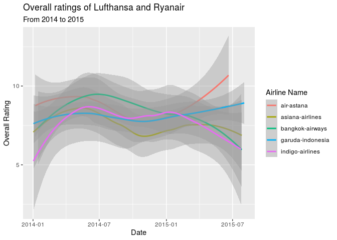

Project proposal
================
macRoni

``` r
library(tidyverse)
library(broom)
library(readr)
library(skimr)
```

## 1\. Introduction

The dataset is a Skytrax User Reviews Dataset (published August 2nd,
2015) at <https://github.com/quankiquanki/skytrax-reviews-dataset> .

General Theme: Which amenities impact the airline rating the most?

## 2\. Data

``` r
airline <- read_csv("/cloud/project/data/airline.csv")
airport <- read_csv("/cloud/project/data/airport.csv")
lounge <- read_csv("/cloud/project/data/lounge.csv")
seat <- read_csv("/cloud/project/data/seat.csv")
```

``` r
glimpse(airline)
```

    ## Rows: 41,396
    ## Columns: 20
    ## $ airline_name                  <chr> "adria-airways", "adria-airways", "adri…
    ## $ link                          <chr> "/airline-reviews/adria-airways", "/air…
    ## $ title                         <chr> "Adria Airways customer review", "Adria…
    ## $ author                        <chr> "D Ito", "Ron Kuhlmann", "E Albin", "Te…
    ## $ author_country                <chr> "Germany", "United States", "Switzerlan…
    ## $ date                          <date> 2015-04-10, 2015-01-05, 2014-09-14, 20…
    ## $ content                       <chr> "Outbound flight FRA/PRN A319. 2 hours …
    ## $ aircraft                      <chr> NA, NA, NA, NA, NA, NA, NA, NA, NA, NA,…
    ## $ type_traveller                <chr> NA, NA, NA, NA, NA, NA, NA, NA, NA, NA,…
    ## $ cabin_flown                   <chr> "Economy", "Business Class", "Economy",…
    ## $ route                         <chr> NA, NA, NA, NA, NA, NA, NA, NA, NA, NA,…
    ## $ overall_rating                <dbl> 7, 10, 9, 8, 4, 9, 5, 9, 8, 10, 9, 7, 8…
    ## $ seat_comfort_rating           <dbl> 4, 4, 5, 4, 4, 4, 4, 5, 4, 5, 4, 4, 4, …
    ## $ cabin_staff_rating            <dbl> 4, 5, 5, 4, 2, 4, 4, 5, 3, 5, 4, 5, 4, …
    ## $ food_beverages_rating         <dbl> 4, 4, 4, 3, 1, 3, 1, 4, 4, 4, 4, 3, 4, …
    ## $ inflight_entertainment_rating <dbl> 0, 1, 0, 1, 2, 3, 0, 3, 1, 4, 4, 3, 0, …
    ## $ ground_service_rating         <dbl> NA, NA, NA, NA, NA, NA, NA, NA, NA, NA,…
    ## $ wifi_connectivity_rating      <dbl> NA, NA, NA, NA, NA, NA, NA, NA, NA, NA,…
    ## $ value_money_rating            <dbl> 4, 5, 5, 4, 2, 4, 3, 4, 4, 4, 4, 5, 4, …
    ## $ recommended                   <dbl> 1, 1, 1, 1, 0, 1, 1, 1, 1, 1, 1, 1, 1, …

``` r
glimpse(airport)
```

    ## Rows: 17,721
    ## Columns: 20
    ## $ airport_name                <chr> "aalborg-airport", "aalborg-airport", "aa…
    ## $ link                        <chr> "/airport-reviews/aalborg-airport", "/air…
    ## $ title                       <chr> "Aalborg Airport customer review", "Aalbo…
    ## $ author                      <chr> "Klaus Malling", "S Kroes", "M Andersen",…
    ## $ author_country              <chr> "Denmark", "Netherlands", "Denmark", "Fra…
    ## $ date                        <date> 2014-02-11, 2013-02-13, 2012-08-07, 2011…
    ## $ content                     <chr> "A small very effective airport with few …
    ## $ experience_airport          <chr> NA, NA, NA, NA, NA, NA, NA, NA, NA, NA, N…
    ## $ date_visit                  <chr> NA, NA, NA, NA, NA, NA, NA, NA, NA, NA, N…
    ## $ type_traveller              <chr> NA, NA, NA, NA, NA, NA, NA, NA, NA, NA, N…
    ## $ overall_rating              <dbl> 9, 9, 9, 5, 4, 5, 4, 1, NA, NA, NA, 2, 8,…
    ## $ queuing_rating              <dbl> 5, 5, 5, 5, NA, NA, NA, NA, NA, NA, NA, 1…
    ## $ terminal_cleanliness_rating <dbl> 5, 4, 5, 5, NA, NA, NA, NA, NA, NA, NA, 3…
    ## $ terminal_seating_rating     <dbl> NA, NA, NA, NA, NA, NA, NA, NA, NA, NA, N…
    ## $ terminal_signs_rating       <dbl> NA, NA, NA, NA, NA, NA, NA, NA, NA, NA, N…
    ## $ food_beverages_rating       <dbl> NA, NA, NA, NA, NA, NA, NA, NA, NA, NA, N…
    ## $ airport_shopping_rating     <dbl> 4, 4, 4, 3, NA, NA, NA, NA, NA, NA, NA, 1…
    ## $ wifi_connectivity_rating    <dbl> NA, NA, NA, NA, NA, NA, NA, NA, NA, NA, N…
    ## $ airport_staff_rating        <dbl> NA, NA, NA, NA, NA, NA, NA, NA, NA, NA, N…
    ## $ recommended                 <dbl> 1, 1, 1, 0, 0, 0, 0, 0, 0, 0, 0, 0, 1, 0,…

``` r
glimpse(lounge)
```

    ## Rows: 2,264
    ## Columns: 21
    ## $ airline_name             <chr> "adria-airways", "aegean-airlines", "aegean-…
    ## $ link                     <chr> "/lounge-reviews/adria-airways", "/lounge-re…
    ## $ title                    <chr> "Adria Airways Business Class Lounge", "Busi…
    ## $ author                   <chr> "R Deu", "Andreas Kar", "A Diakomichalis", "…
    ## $ author_country           <chr> "Spain", "Germany", "Greece", "Spain", "Unit…
    ## $ date                     <date> 2014-03-09, 2015-06-13, 2014-10-05, 2014-03…
    ## $ content                  <chr> "There are 2 separate areas with arm chairs …
    ## $ lounge_name              <chr> "ADRIA AIRWAYS BUSINESS CLASS LOUNGE REVIEW"…
    ## $ airport                  <chr> NA, "Larnaca Airport", "Athens Airport", "At…
    ## $ lounge_type              <chr> "Business Class", "Business Class", "Busines…
    ## $ date_visit               <chr> NA, "13-03-2015", NA, NA, NA, NA, NA, NA, NA…
    ## $ type_traveller           <chr> NA, "Solo Leisure", NA, NA, NA, NA, NA, NA, …
    ## $ overall_rating           <dbl> 3, 5, 5, 2, 5, 4, 4, 3, 3, 4, 3, 2, 1, 3, 4,…
    ## $ comfort_rating           <dbl> 3, 4, 5, 3, 5, 4, 4, 4, 4, 4, 3, 4, 1, 4, 4,…
    ## $ cleanliness_rating       <dbl> 4, 4, 5, 3, 5, 5, 5, 4, 4, 5, 4, 3, 3, 3, 4,…
    ## $ bar_beverages_rating     <dbl> 3, 3, 5, 2, 4, 3, 3, 2, 3, 4, 3, 1, 1, 4, 4,…
    ## $ catering_rating          <dbl> 3, 3, 4, 1, 4, 2, 3, 2, 1, 2, 1, 1, 1, 4, 4,…
    ## $ washrooms_rating         <dbl> 3, 3, 4, 2, 4, 4, 4, 3, 3, 4, 3, 0, 1, 2, 4,…
    ## $ wifi_connectivity_rating <dbl> 2, 4, 5, 3, 5, 5, 5, 4, 3, 4, 4, 4, 1, 4, 5,…
    ## $ staff_service_rating     <dbl> 2, 4, 5, 2, 5, 3, 4, 1, 1, 3, 3, 2, 1, 2, 4,…
    ## $ recommended              <dbl> 1, 1, 1, 0, 1, 0, 0, 0, 0, 1, 0, 0, 0, 0, 1,…

``` r
glimpse(seat)
```

    ## Rows: 1,258
    ## Columns: 21
    ## $ airline_name        <chr> "aegean-airlines", "aegean-airlines", "aer-lingus…
    ## $ link                <chr> "/seat-reviews/aegean-airlines", "/seat-reviews/a…
    ## $ title               <chr> "Aegean Airlines customer review", "Aegean Airlin…
    ## $ author              <chr> "Jay Simpson", "Paul Staples", "L Pulliam", "D Br…
    ## $ author_country      <chr> "United Kingdom", "United Kingdom", "United State…
    ## $ date                <date> 2015-07-20, 2013-01-21, 2015-07-07, 2010-10-22, …
    ## $ content             <chr> "LHR to Larnaca return. Plane was clean and in go…
    ## $ aircraft            <chr> "A320-200", "AIRBUS A320", "A330", "Airbus A330",…
    ## $ seat_layout         <chr> "3x3", "3x3", "2x4x2", "2x4x2", "3x3", "2-4-2", "…
    ## $ date_flown          <chr> "19-07-2015", NA, "06-07-2015", NA, "01-07-2015",…
    ## $ cabin_flown         <chr> "Economy", "Economy", "Economy", "Economy", "Econ…
    ## $ type_traveller      <chr> "Solo Leisure", NA, "Couple Leisure", NA, "Busine…
    ## $ overall_rating      <dbl> 10, 9, 6, 5, 1, 9, 6, 4, 7, 6, 9, 10, 1, 7, 1, 2,…
    ## $ seat_legroom_rating <dbl> 4, 4, 3, 2, 1, 5, 4, 2, 3, 3, 5, 5, 1, 3, 1, 1, 4…
    ## $ seat_recline_rating <dbl> 4, 4, 3, 3, 1, 3, 4, 1, 3, 3, 5, 4, 3, 3, 1, 2, 4…
    ## $ seat_width_rating   <dbl> 4, 4, 3, 3, 1, 5, 4, 3, 3, 3, 4, 4, 3, 3, 3, 2, 3…
    ## $ aisle_space_rating  <dbl> 5, 4, 3, 3, 2, 5, 3, 2, 4, 3, 3, 5, 1, 3, 1, 1, 4…
    ## $ viewing_tv_rating   <dbl> 4, 4, 3, 4, 1, 5, 3, 0, 4, 0, 0, 5, 2, 3, 2, 2, 4…
    ## $ power_supply_rating <dbl> NA, NA, 3, NA, 5, 5, NA, NA, NA, NA, NA, NA, NA, …
    ## $ seat_storage_rating <dbl> 4, NA, 3, NA, 1, 5, NA, NA, NA, NA, NA, NA, NA, N…
    ## $ recommended         <dbl> 1, 1, 1, 0, 1, 1, 1, 0, 1, 0, 1, 1, 0, 1, 0, 0, 1…

## 3\. Data analysis plan

We first began by exploring the overall average ratings of the different
airlines.

``` r
airline %>%
  group_by(airline_name) %>%
  summarise( average_overall_rating = mean(overall_rating, na.rm = TRUE)) %>%
  arrange(desc(average_overall_rating))
```

    ## `summarise()` ungrouping output (override with `.groups` argument)

    ## # A tibble: 362 x 2
    ##    airline_name             average_overall_rating
    ##    <chr>                                     <dbl>
    ##  1 beijing-capital-airlines                  10   
    ##  2 danish-air                                10   
    ##  3 eastarjet                                 10   
    ##  4 la-compagnie                              10   
    ##  5 loganair                                  10   
    ##  6 air-busan                                  9.45
    ##  7 atlantic-airways                           9.25
    ##  8 avianca-brasil                             9   
    ##  9 europe-airpost                             9   
    ## 10 jeju-air                                   9   
    ## # … with 352 more rows

Next, we visualised the distribution of the traveller types the airline
attracts. Although, this visualization doesn’t take into account the
31018 missing values.

``` r
airline %>%
  filter(type_traveller != "NA") %>%
  ggplot( mapping = aes( y = type_traveller)) +
  geom_bar() +
  labs( title = "Distribution of the traveller types", 
        y = "Traveller types" 
        ) +
  theme_minimal()
```

<!-- -->

1.  How does the overall ratings for airlines change depending of the
    time of year? Do these patterns repeat every year? Which traveller
    type is prev during which time of the year?

Which type of travelers in first class give better overall ratings than
passengers in other classes? Does this alternate between different
airlines?

First, all NAs for the response variable and the predictor were removed.

``` r
airline_nonas <- airline %>%
  drop_na(overall_rating) #removing any NAs
```

Next, we want to investigate how time affects ratings. As the research
question focuses on how airlines get high ratings, the five airlines
with the highest rating were found. A limit of at least 100 survey
submissions was imposed to increase the number of data points.

    ## # A tibble: 106 x 3
    ##    airline_name       mean_overall_rating     n
    ##    <chr>                            <dbl> <int>
    ##  1 asiana-airlines                   8.35   301
    ##  2 garuda-indonesia                  8.31   351
    ##  3 air-astana                        8.28   103
    ##  4 bangkok-airways                   8.12   213
    ##  5 indigo-airlines                   8.08   104
    ##  6 korean-air                        8.03   315
    ##  7 eva-air                           7.98   296
    ##  8 aegean-airlines                   7.82   227
    ##  9 singapore-airlines                7.77   432
    ## 10 airasia-x                         7.71   246
    ## # … with 96 more rows

These airlines were plotted against time to identify any correlations.

<!-- -->

As the visualization shows, all of the airlines receive ratings in
between 5-10, with air-astana showing an increase at the end of 2015.
For indigo-airlines, garuda-indonesia and bangkok-airlines, the ratings
deteriorated at the end of 2015. Garuda-indonesia ratings stay constant
throughout both years.

There is no clear pattern in each year, which makes sense as the airline
companies will normally try to provide the same service throughout the
year.

2.  To what extent do passengers in first class give better overall
    ratings than passengers in other classes? Does this alternate
    between different airplane types? Y: overall\_rating X:
    type\_traveller , cabin\_flown, airline\_name

Let’s look at the average overall rating the passengers gave for each of
the classes.

``` r
airline %>%
  filter(!is.na(overall_rating), !is.na(cabin_flown) ) %>%
  group_by(cabin_flown) %>%
  summarise(mean_overall_rating = mean(overall_rating, na.rm = TRUE))
```

    ## `summarise()` ungrouping output (override with `.groups` argument)

    ## # A tibble: 4 x 2
    ##   cabin_flown     mean_overall_rating
    ##   <chr>                         <dbl>
    ## 1 Business Class                 6.87
    ## 2 Economy                        5.97
    ## 3 First Class                    6.65
    ## 4 Premium Economy                5.86

Hypothesis: we expect first class to have a higher rating and will use
the correlation between overall rating and cabin flown to validate our
hypothesis.

Business class has received the highest amount of rating. It is closely
followed by First class. This doesn’t match our hypothesis.

Is this because passengers feel the business class services are better
or fewer people choose to travel in first class? Let’s find out\!

``` r
airline %>%
  filter(!is.na(overall_rating), !is.na(cabin_flown) ) %>%
  group_by(cabin_flown) %>%
  count(cabin_flown) %>%
  arrange(desc(n))
```

    ## # A tibble: 4 x 2
    ## # Groups:   cabin_flown [4]
    ##   cabin_flown         n
    ##   <chr>           <int>
    ## 1 Economy         26429
    ## 2 Business Class   6133
    ## 3 Premium Economy  1445
    ## 4 First Class       846

Now, it is obvious that first class has a lower rating compared to
business class since fewer passengers chose that cabin type.

Sub question: What is the distribution of traveller\_type in each of the
cabin\_flown categories?

``` r
airline %>%
  filter (!is.na(cabin_flown), !is.na(type_traveller), !is.na(overall_rating) ) %>%
  ggplot(aes(x = cabin_flown, fill = type_traveller)) +
  geom_bar(position ="fill") +
  coord_flip()
```

<!-- -->

This reveals the type of travellers in each of the cabins.

For first class, as expected, the solo leisure traveller\_type prevails.
This adds up since the tickets may cost significantly more than any of
the other classes so it may not be pocket-friendly to travel in larger
groups than 1.

A few other observations that can be made are: Travelers who are flying
for business trips prefer the Business Class which does make sense since
they may be travelling often and can use their loyalty card points for
an upgrade to a business class.

From a pocket-friendly and budgeting point of view, it makes sense that
the family leisure traveler category is mostly found in the Economy
class.

Next, let’s explore how the overall flight rating varies.

``` r
airline %>%
  filter(!is.na(overall_rating)) %>%
  group_by(overall_rating) %>%
  count(overall_rating) 
```

    ## # A tibble: 10 x 2
    ## # Groups:   overall_rating [10]
    ##    overall_rating     n
    ##             <dbl> <int>
    ##  1              1  5390
    ##  2              2  2996
    ##  3              3  2375
    ##  4              4  1810
    ##  5              5  2538
    ##  6              6  1814
    ##  7              7  3336
    ##  8              8  5329
    ##  9              9  5412
    ## 10             10  5861

``` r
airline %>% 
  filter(!is.na(overall_rating)) %>%
  group_by(overall_rating) %>%
  count(overall_rating) %>%
  ggplot(aes(x=factor(overall_rating), y = n)) + ## want to fill it by cabin_flown but running into errors 
  geom_col() 
```

<!-- -->

Majority of the travelers have rated the airlines a 10 (5861 to be
exact) but ratings like 8, 9, 10 are also common. Surprisingly, the
extreme value of rating = 1 is also frequent.

Do airlines improve their ratings with a particular reviewer over time,
if so in which category are the improvements made Y: overall\_rating,
other variables TBD after the most significant contributor is found X:
author, date, airline\_name

Do positive reviews on an airline and positive reviews on lounge and
seat have a correlation? Y: a graph showing correlation X:
overall\_rating (in seat and lounge data set )

Hypothesis: we expect seat rating to have a stronger correlation than
the lounge rating because not everyone uses the lounge.

***Question to the instructor: Is it possible to segment the reviews
into “positive” and “negative” ones (using text analysis on the content
column) and replace all the positive and negative reviews with the words
“good” or “bad”?***
